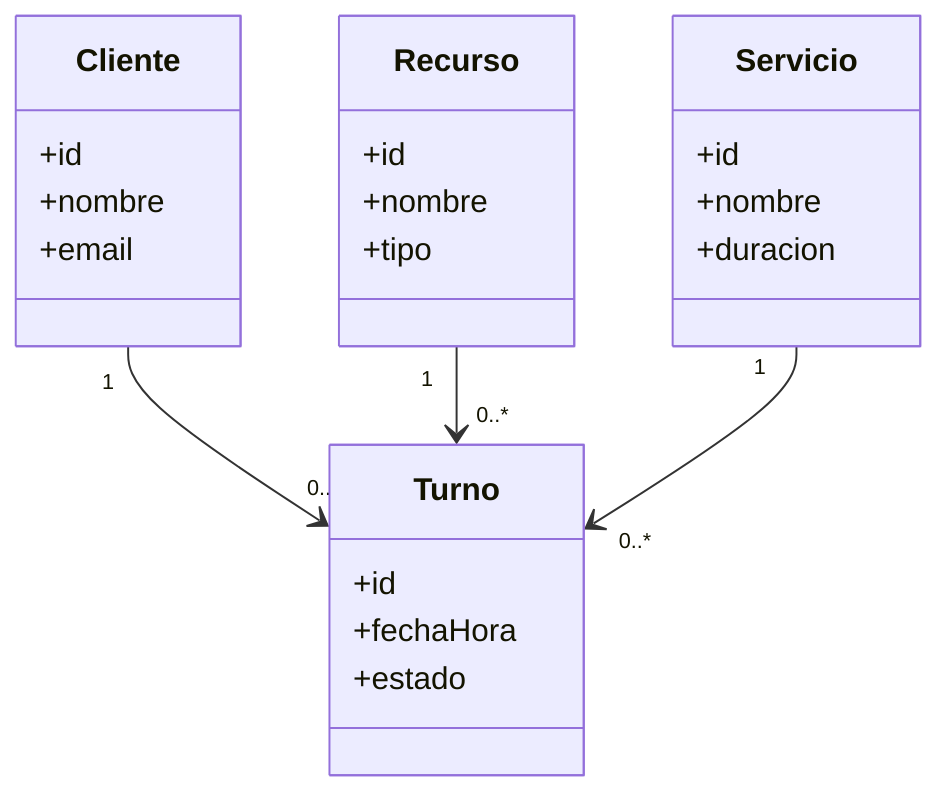

# Modelo (comodín)

```mermaid
classDiagram
class Cliente {
  +id
  +nombre
  +email
}
class Recurso {
  +id
  +nombre
  +tipo
}
class Turno {
  +id
  +fechaHora
  +estado
}
class Servicio {
  +id
  +nombre
  +duracion
}

Cliente "1" --> "0..*" Turno
Recurso "1" --> "0..*" Turno
Servicio "1" --> "0..*" Turno
```
